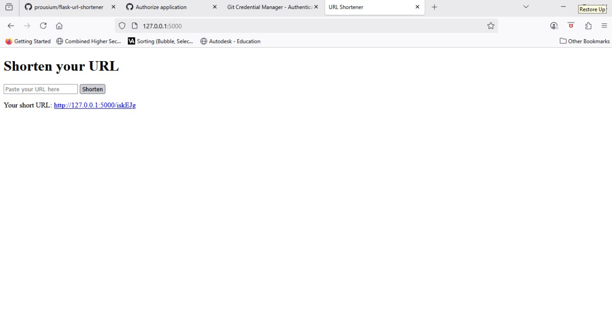
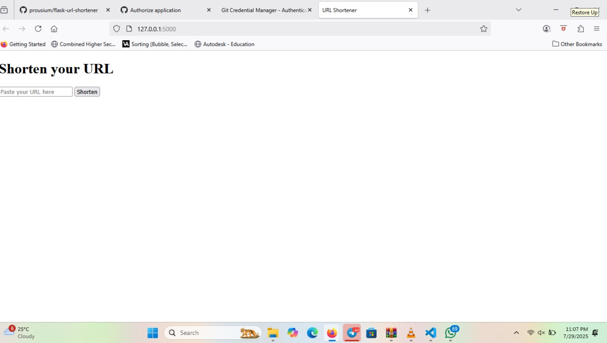
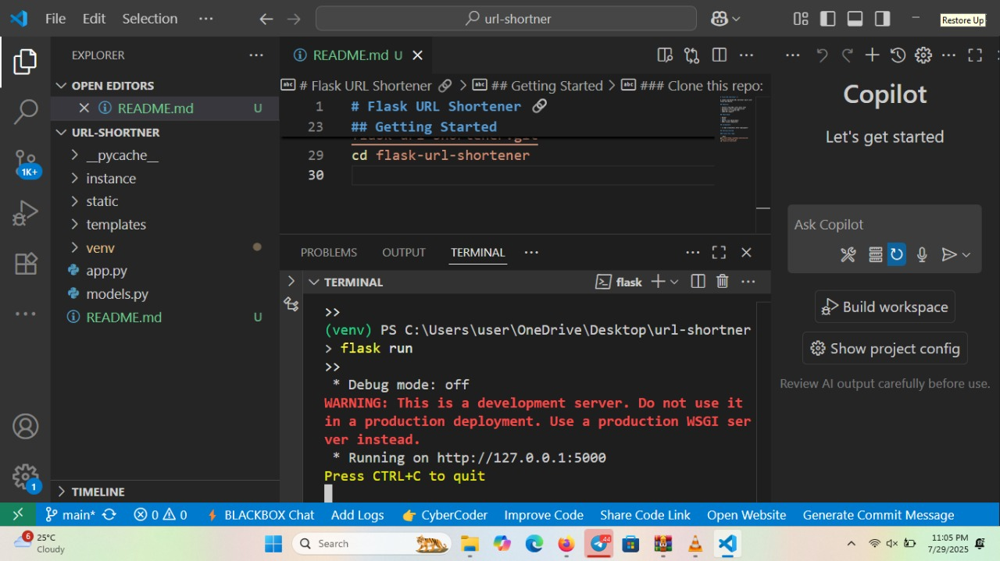

# Flask URL Shortener 🔗

A simple web-based URL shortener built with Flask and SQLite.

## Features

- Convert long URLs into short ones
- Automatic short-code generation
- Redirect to original URL
- JSON API support

## Tech Stack

- Python
- Flask
- SQLite (via SQLAlchemy)
- HTML (Jinja templates)

## Screenshots



> 
## Getting Started

### Clone this repo:

```bash
git clone https://github.com/prousium/flask-url-shortener.git
cd flask-url-shortener

